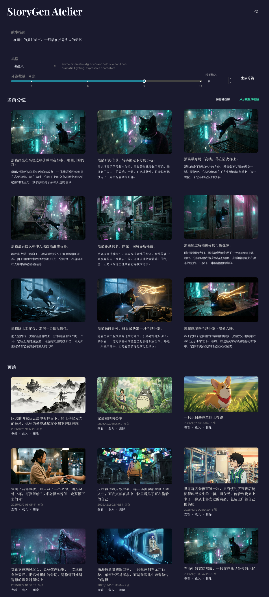
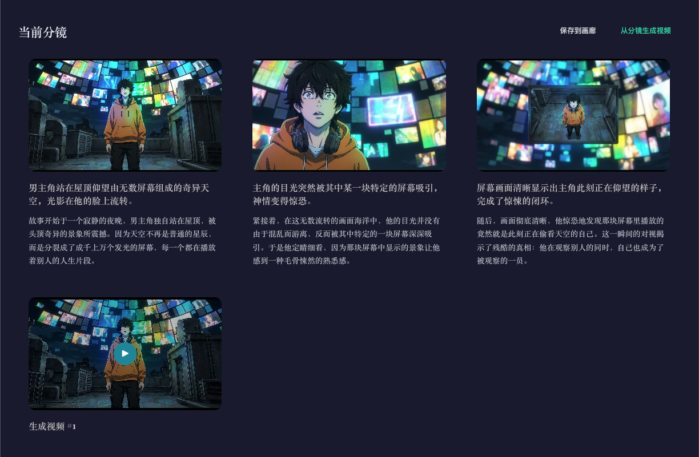
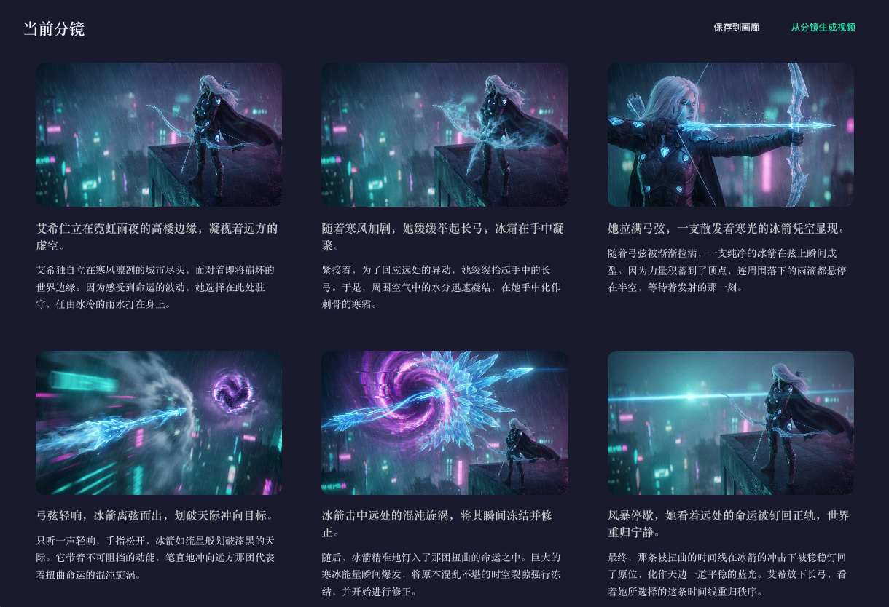
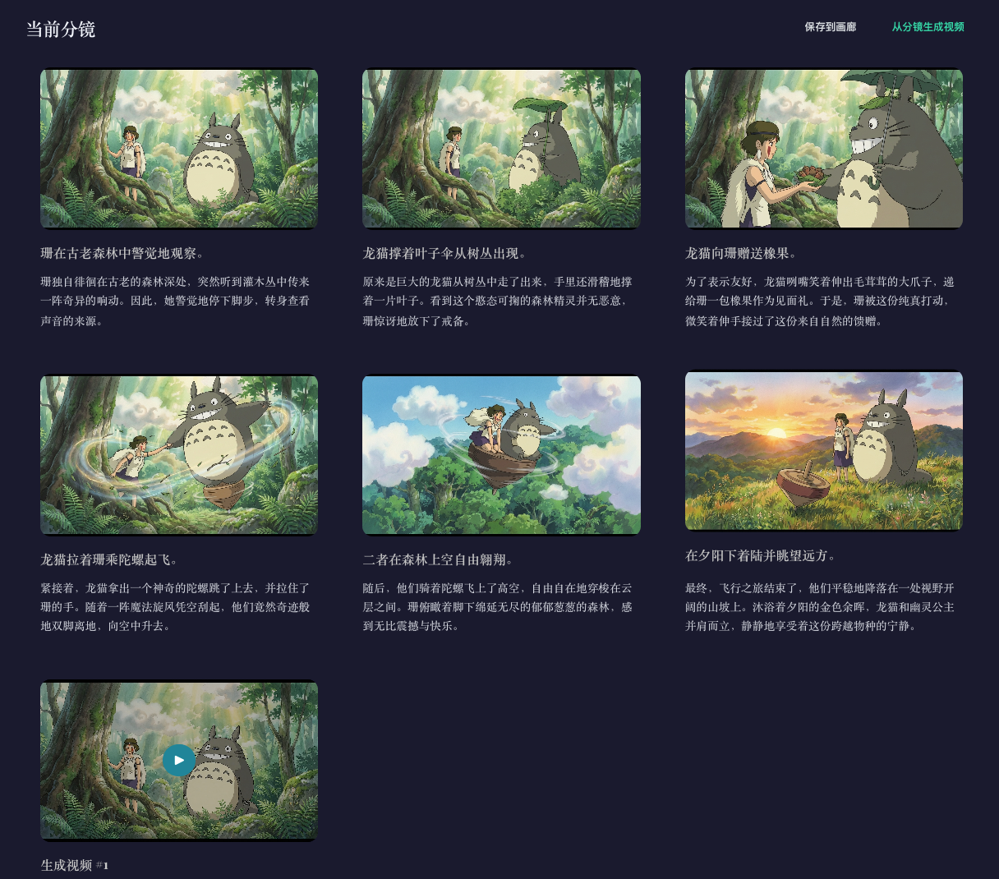
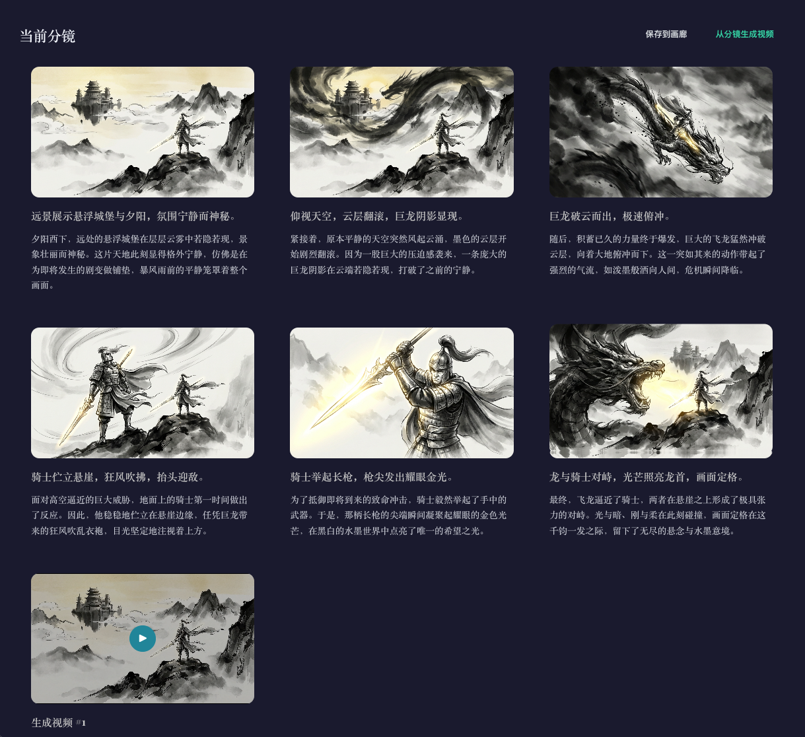

# StoryGen Atelier
[English](README_EN.md) | [中文](README_CN.md)

AI-assisted storyboard and video generation tool. Uses Gemini for generating storyboard text and frames, Vertex AI Veo for generating transition clips, and ffmpeg for stitching the final video. Built-in logs and gallery management.



## Features
- **Storyboard Generation**: Gemini text model generates storyboard scripts, and Gemini image model generates frames; supports custom styles and shot counts.
- **Video Generation**: Based on the Interpolation Chain of the storyboard, calls Vertex Veo to generate clips and stitches them into a full video using ffmpeg.
- **Logs Dashboard**: Video logs + Storyboard logs (SQLite persistence), supports viewing, exporting, and clearing.
- **Gallery**: Save, load, and delete generated storyboards + videos.
- **Prompt Guide**: Built-in `guide/VideoGenerationPromptGuide.md` for model prompting reference.

## Core Technology: Video Generation & Stitching Algorithm
This project uses an **"Interpolation Chain" (Sliding Window)** strategy to transform static storyboard images into a coherent video story. The process is fully automated and consists of three main phases:

### 1. Transition Analysis - Gemini
The system first iterates through the storyboard list using a sliding window to process each pair of adjacent shots (Shot A → Shot B).
- **Intelligent Analysis**: Calls the **Gemini** model to analyze the visual content of Shot A and Shot B.
- **Instruction Generation**: Gemini outputs a specific **Transition Prompt** and a suggested **Duration**, detailing how to smoothly transition from the first frame to the second (e.g., "Slow dolly zoom in while panning right...").

### 2. Clip Generation - Vertex AI Veo
Based on the analysis from step 1, **Vertex AI (Veo model)** is called in parallel to generate video clips.
- **Intermediate Transitions**: For each pair of shots (A, B), the Gemini-generated prompt + Shot A (start frame) + Shot B (end frame) are sent to Veo to generate a connecting video clip.
- **Closing Shot**: For the final shot (Shot N), the system generates a separate "Closing Shot" clip, using prompts like "Hold on the final frame with a gentle cinematic finish" to give the story an elegant static or subtle ending.

### 3. Final Assembly - FFmpeg
Once all clips (transition clips + closing clip) are generated, the backend uses **FFmpeg** for lossless stitching.
- **Sequence Assembly**: All generated `.mp4` clips are written to a list in chronological order.
- **Stream Copy**: Uses the `concat` protocol and copy mode (`-c copy`) to quickly merge video streams, avoiding quality loss from re-encoding, and finally outputs the complete `full_story_xxx.mp4` file.

## Tech Stack
- **Frontend**: React, Vite, Mantine UI (Component Library)
- **Backend**: Node.js (Express), better-sqlite3 (High-performance data storage), fluent-ffmpeg (Video stitching)
- **AI Services**: Google Gemini (Text/Image), Google Vertex AI Veo (Video Generation)

## Directory Structure
```
backend/    Node.js + Express API, calls Gemini/Vertex, manages logs & data
frontend/   React + Vite + Mantine UI
guide/      Prompt guides
exampleImg/ Example storyboard frames for README (exported from local data)
backend.log / frontend.log Runtime logs
```

## Requirements
- Node.js 18+, npm
- ffmpeg
- **Google Cloud Project**: Must enable **Vertex AI API** (Veo model used for video generation)
- **Gemini API Key**: Used for storyboard script and image generation

## Environment Variables
Configure in `backend/.env` (copy from `.env.example`):
```
PORT=3005
GEMINI_API_KEY=your_gemini_api_key
GEMINI_TEXT_MODEL=gemini-3-pro-preview
GEMINI_IMAGE_MODEL=gemini-3-pro-image-preview
# Vertex AI (Required for video generation)
VERTEX_PROJECT_ID=your_gcp_project_id
VERTEX_LOCATION=us-central1
VERTEX_VEO_MODEL=veo-3.1-generate-preview
```

## Quick Start (Recommended)
No need to start backend and frontend separately. Run from the root directory:
```bash
# Grant execution permission (only needed once)
chmod +x start_servers.sh
# Start servers
./start_servers.sh
```
The script will automatically:
1. Start the backend API on port **3005**
2. Start the frontend interface on port **5180**
3. Output logs to `backend.log` and `frontend.log` respectively

## Manual Install & Start
Backend:
```bash
cd backend
npm install
cp .env.example .env  # And fill in real keys
npm run dev           # Or npm start
```
Frontend (Default port 5180):
```bash
cd frontend
npm install
npm run dev
```
Build:
```bash
cd frontend && npm run build
```

## Examples
- Storyboard Style Examples:
  - Anime Style Example：

https://github.com/user-attachments/assets/a70279b0-80f7-4b9a-96fb-173e5912d43a

  - 

https://github.com/user-attachments/assets/66bbe81e-34f1-44dd-b648-2a8cb84e5eba 
  - Cyberpunk Example：  

https://github.com/user-attachments/assets/ad56e3c8-c14e-48fb-8366-ad22c4e8ea60


  - Ghibli Style Example：  

https://github.com/user-attachments/assets/fe6c57fa-0bb5-4c81-8efb-1c7c52011948


  - Realism Example：

https://github.com/user-attachments/assets/2ca41cbf-2765-4e6b-8e85-8ba0e8e191f5


  - Chinese Ink Example：  

https://github.com/user-attachments/assets/99305353-a348-45ca-add7-f9692bccdc95
